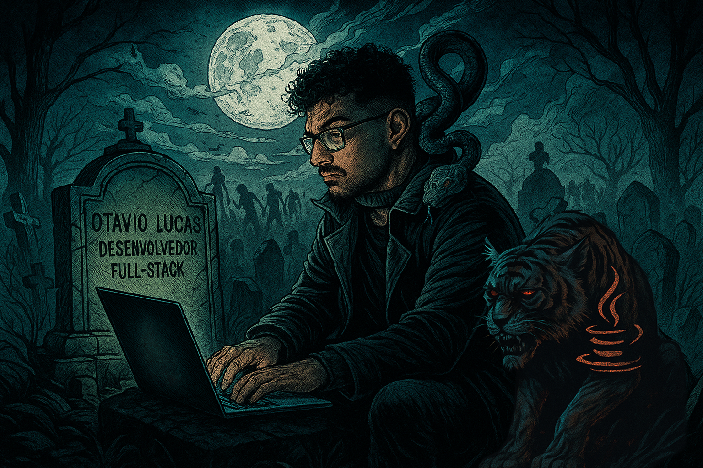

  

<table>
  <tr>
   
   <td>
      <h3>Sobre mim</h3>
      Olá! Sou <strong>Otavio</strong>, desenvolvedor <strong>Full Stack</strong> com foco em <strong>Back-End</strong> (Java e Python). 
      Em meio ao apocalipse zumbi digital, enfrento os bugs e desafios como um verdadeiro sobrevivente — minha arma é o código limpo, eficiente e resiliente. 
      Transformo ameaças em soluções, sempre buscando evolução, performance e segurança. 
      Aqui você encontra projetos inovadores, muitos códigos em constante aprimoramento e uma mentalidade voltada para resultados. 
      <strong>Pronto para sobreviver ao caos tecnológico? Junte-se a mim!</strong>
    </td>
  </tr>
</table>

  <strong>Dev Full Stack por instinto, especialista em Back-End por sobrevivência.</strong> 
  <em>“No apocalipse zumbi da tecnologia, liderança, estratégia e conhecimento são as únicas armas para prosperar — e eu estou sempre preparado!”</em>

### 🔭 **O que você vai encontrar aqui**:  
- **Projetos pessoais**: soluções inovadoras em Java, Python e mais.
- **Desafios técnicos**: problemas complexos que eu enfrento e resolvo.
- **Conteúdo prático**: dicas, aprendizados e insights para devs que querem se destacar.
- **Skills de sobrevivência**: tecnologias que domino para enfrentar qualquer apocalipse digital.

💡 **Sinta-se à vontade para explorar, contribuir ou aprender — juntos, somos mais fortes!**

---

## Skill Set

  
  
  
  
  
  
  
  
  

---

## 👀 **O que me destaca?**

- **Especialista Back-End**: Java, Python, APIs REST, bancos de dados SQL/NoSQL
- **Full Stack Survivor**: experiência também com Front-End moderno
- **Resiliência**: enfrentando problemas críticos sob pressão
- **Evolução constante**: sempre atualizado com as melhores práticas do mercado
- **Marketing Pessoal**: protagonista em projetos que geram impacto real

---

## 📊 Estatísticas

  
  

---

### 🌐 **Conecte-se comigo**  

  
  
  

